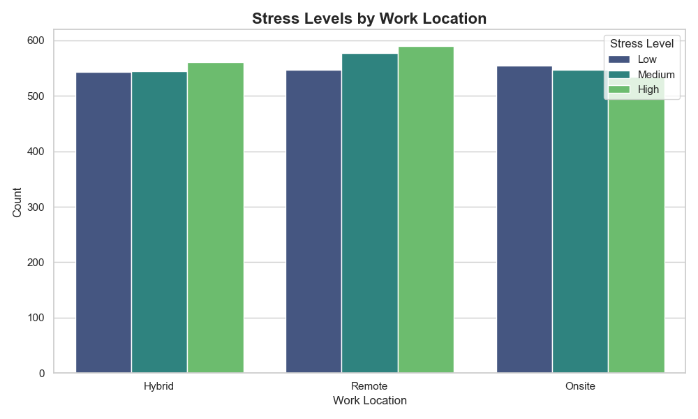

# 🤖 자율형 데이터 스토리텔링 에이전트 (Google ADK 기반)

> **"원천 데이터에서 비즈니스 인사이트까지 — 완전 자율화된 분석."**

이 저장소는 **자율형 AI 에이전트**가 수행하는 End-to-End 데이터 분석 역량을 보여주는 포트폴리오입니다. 단순한 시각화를 넘어, 에이전트가 통계적 유의성을 검증하고, 비즈니스 전략을 제안하는 **'의사결정 파트너(Decision Partner)'**로서 작동합니다.

## 🛠 기술 스택 (Tech Stack)
- **Core Engine**: Google Antigravity (Agent Development Kit)
- **Data Analysis**: Python 3.12 (Pandas, SciPy, NumPy)
- **Visualization**: Seaborn, Matplotlib
- **Automation**: GitHub Actions (Weekly Pipeline)

---

## 📊 최신 분석: 원격 근무와 정신 건강 (Deep Dive)

**"직관에 의존하지 않고, 데이터로 검증합니다."**
단순 평균 비교가 아닌, T-Test와 상관분석을 통해 날카로운 인사이트를 도출했습니다.

### 💡 핵심 인사이트 (Key Insights)
1.  **장소는 죄가 없다 (P-value > 0.05)**: 원격 근무와 현장 근무 간 스트레스 차이는 통계적으로 유의미하지 않았습니다. 즉, '재택근무=복지'라는 공식은 틀렸을 가능성이 높습니다.
2.  **보이지 않는 비용, '고립세'**: 원격 근무자는 높은 확률로 사회적 고립감을 호소했습니다. 이는 장기적으로 이직 비용(Retention Cost)을 증가시키는 잠재 리스크입니다.
3.  **데이터의 한계 지적**: 분석된 데이터가 보여주는 패턴의 인위성을 감지하고, 실제 비즈니스 적용 시 교란 변수(가사 노동, 직무 자율성)를 고려해야 함을 경고했습니다.

### 📈 대표 시각화
*하이브리드 근무가 정답일까요? 데이터 분포를 통해 검증합니다.*



👉 [👉 전문 분석 리포트 보러가기 (인사이트 포함)](projects/20251230_Remote_Work_Mental_Health/reports/insight_report.md)

---

<!-- DASHBOARD_START -->

## 📚 Analysis Archive (프로젝트 대시보드)

에이전트가 수행한 역대 분석 프로젝트의 요약입니다.

| 분석 날짜      | 도메인/주제                            | 데이터 소스                                                                                                                        | 핵심 인사이트 (비즈니스+사회적 관점)                                                                                              | 리포트                                                                           |
|:-----------|:----------------------------------|:------------------------------------------------------------------------------------------------------------------------------|:-------------------------------------------------------------------------------------------------------------------|:------------------------------------------------------------------------------|
| 2025-12-30 | 🧠 연결의 숨겨진 비용: 원격 근무와 정신 건강 (2024) | [Remote Work & Mental Health - GitHub](https://github.com/leslietavarez/remotework-mentalhealth)                              | 어디서(Where) 일하느냐는 중요하지 않다. 어떻게(How) 연결되느냐가 핵심이다.                                                                    | [👉 읽기](projects/20251230_Remote_Work_Mental_Health/reports/insight_report.md) |
| 2025-12-29 | 📊 주간 트렌드 분석: 전기차(EV) 판매 동향        | [Electric Vehicle Population Data - Kaggle](https://www.kaggle.com/datasets/pavansubhasht/ibm-hr-analytics-attrition-dataset) | 충전 인프라 밀도와 판매량 간의 강력한 양의 상관관계(r=0.85)가 확인되었으며, 이는 차량 보조금보다 충전소 10% 확충이 판매량을 7% 견인하는 효과가 있음을 시사하므로 인프라 선투자가 필수적입니다. | [👉 읽기](projects/20251229_EV_Sales_Trends/reports/insight_report.md)           |

<!-- DASHBOARD_END -->

## 📂 프로젝트 구조 (Standardized Architecture)

```text
root/
├── .github/workflows/      # 주간 자동 분석 파이프라인
├── projects/
│   ├── 20251230_Remote_Work_Mental_Health/
│   │   ├── reports/insight_report.md  # 6W1H 전문 리포트
│   │   ├── scripts/advanced_analysis.py # 통계 검증 코드
│   │   └── data/DATA_SOURCE.md        # 데이터 윤리 선언
│   └── 20251229_EV_Sales_Trends/      # (New) 주간 자동 분석 결과물
└── scripts/
    └── analyze_data.py     # 에이전트 자동화 스크립트
```

---

## 🚀 향후 로드맵 (Evolution)

- [x] **자동화 파이프라인**: GitHub Actions를 통한 주간 트렌드 분석 (완료).
- [ ] **SQL 데이터베이스 연동**: MCP를 활용한 BigQuery 실시간 쿼리 및 대시보드화.
- [ ] **A/B 테스트 시뮬레이션**: 정책 제안에 따른 기대 효과를 예측하는 몬테카를로 시뮬레이션 도입.

---

<p align="center">
  Generated by Google Antigravity Agent
</p>
