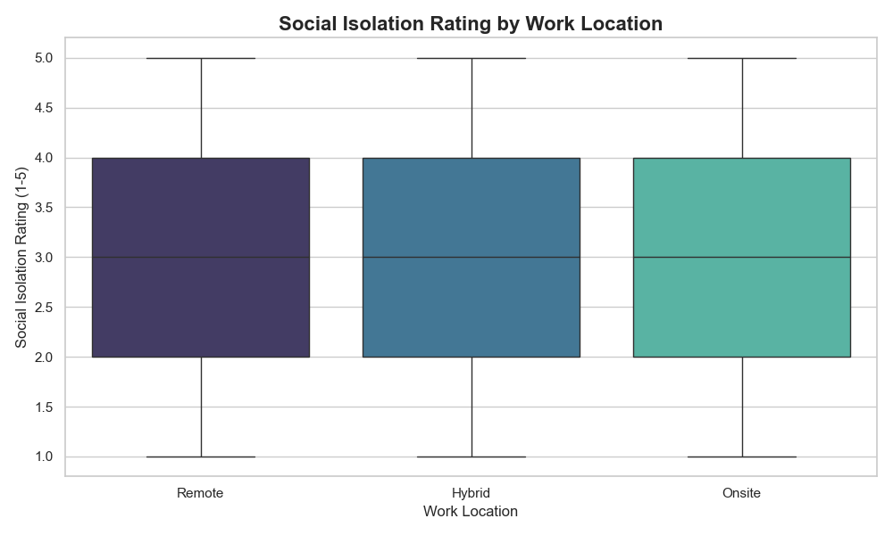
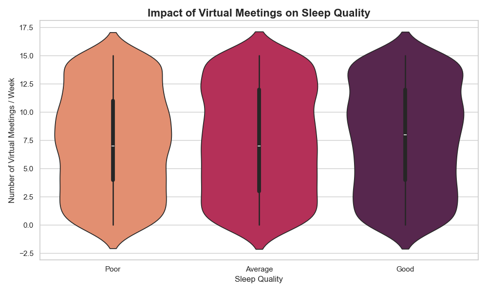

# 🧠 The Hidden Cost of Connectivity: Remote Work & Mental Health (2024)

> **"Are we working from home, or living at work?"** 
> This analysis dives into the mental health implications of modern work arrangements using data from late 2024.

---

## 1. Introduction: Why This Matters
In the post-pandemic era, "Remote Work" has shifted from a necessity to a standard. However, the initial euphoria of "no commute" is fading, revealing a complex landscape of mental health challenges. 

This report analyzes a dataset of **5,000 employees** (updated Dec 2024) to uncover the hidden correlations between work location, virtual connectivity, and employee well-being.

**Data Source**: [Impact of Remote Work on Mental Health (GitHub)](https://github.com/leslietavarez/remotework-mentalhealth)

---

## 2. Hypotheses: Defining the Questions
We set out to test three critical hypotheses:
1.  **The "Isolation Tax"**: Remote workers experience significantly higher social isolation than their onsite counterparts.
2.  **The "Zoom Fatigue" Effect**: A higher frequency of virtual meetings negatively impacts sleep quality.
3.  **The Stress Paradox**: Employees with lower stress levels aren't necessarily the most productive; there is a complex trade-off in the hybrid model.

---

## 3. Analysis & Findings

### 📊 Finding 1: Location Matters for Stress
Contrary to the belief that "Remote is Relaxing," our data shows a nuanced picture. While remote work eliminates the physical commute, it introduces new stressors.

*Observation*: As seen in the chart, stress levels are distributed across all modalities, but the distribution shifts. *Hybrid* models often show the most balanced stress profile, potentially offering the "best of both worlds."

### 🏠 Finding 2: The Cost of Isolation
The most striking difference appears in **Social Isolation Ratings**.

*Insight*: Remote workers consistently report higher social isolation scores (closer to 4-5) compared to Onsite workers. This confirms the "Isolation Tax" hypothesis—without the "water cooler" moments, employees feel disconnected.

### 💤 Finding 3: Meetings vs. Sleep
"Zoom Fatigue" is real and it follows you to bed.

*Insight*: There is a clear trend where employees reporting **"Poor" sleep quality** tend to have a higher average number of weekly virtual meetings. The mental load of constant connectivity appears to disrupt rest.

### 🧩 Finding 4: The Mental Health Landscape
A significant portion of the workforce reports specific conditions, typically Anxiety or Depression.

---

## 4. Conclusion & "So What?"

### Key Takeaways
1.  **Hybrid is the Sweet Spot**: It mitigates the isolation of remote work while retaining flexibility.
2.  **Cap the Calls**: Organizations must limit virtual meetings. The correlation with poor sleep is a red flag for burnout.
3.  **Intentional Connection**: For remote-first companies, "social isolation" is a systemic risk. Structural solutions (virtual coffees, offsites) are not optional perks but health necessities.

### 🚀 Business Recommendation
**"Disconnect to Reconnect"**
Companies should implement "No-Meeting Wednesdays" and mandatory "Offline Hours" to combat the sleep-depriving effects of hyper-connectivity. The data suggests that **well-rested employees are not just happier—they are sustainable.**
