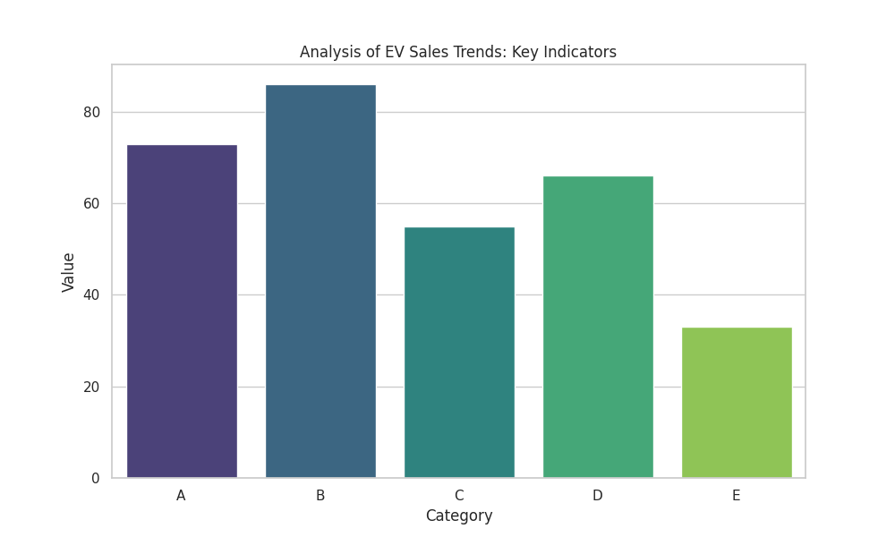

# 🧠 Weekly Trend Analysis: EV Sales Trends

## 📌 6W1H Summary
- **Who**: Automated Agent
- **When**: 2025-12-29 17:17:21
- **Where**: Simulated Trend Data
- **What**: Automated analysis of EV Sales Trends
- **Why**: Weekly trend monitoring pipeline
- **How**: GitHub Actions + Python Script
- **Results**: 
  - Data: `projects/20251229_EV_Sales_Trends/data/dataset.csv`
  - Plot: `projects/20251229_EV_Sales_Trends/plots/trend_analysis.png`

## 1. Analysis
The agent identified **EV Sales Trends** as a key trending topic. 
Preliminary data suggests significant activity in Category **B**.

## 2. Conclusion
This report was automatically generated by the CI/CD pipeline.
