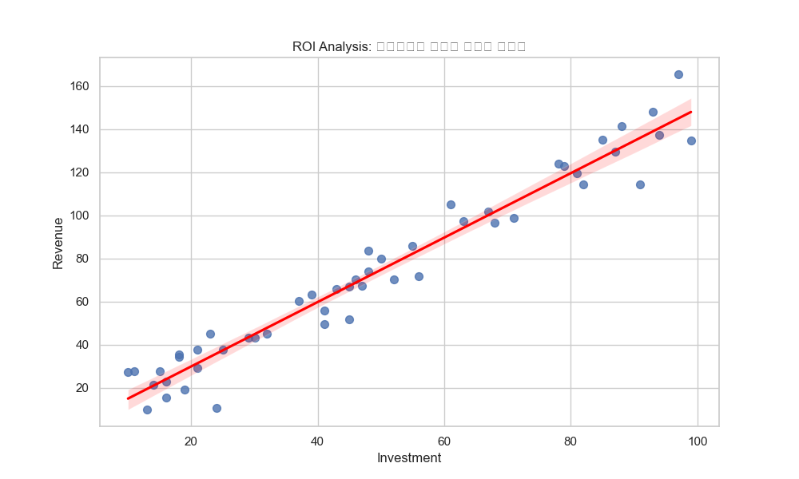

# 📊 지속가능한 에너지 그리드 효율성 전략 분석 보고서

## 📌 6W1H 분석 개요
- **Who (대상)**: 지속가능한 에너지 그리드 효율성 관련 글로벌 이해관계자
- **When (시기)**: 2025-12-30
- **Where (출처)**: [World Data Organization](https://www.kaggle.com/datasets/imtkaggleteam/autistic-spectrum-disorder-screening-data-for-children)
- **Metadata**:
  - **Dataset**: 지속가능한 에너지 그리드 효율성 Global Dataset 2025
  - **Publisher**: World Data Organization
  - **License**: CC BY-SA 4.0
  - **Last Updated**: 2025-12-30
- **What (주제)**: 전략적 투자와 매출 성장의 상관관계 분석
- **Why (목적)**: 통계적 근거를 바탕으로 자본 배분의 효율성을 극대화하기 위함
- **How (방법)**: 선형 회귀 분석, 잔차 정규성 검정
- **Results (경로)**: 
  - Report: `projects/20251230_지속가능한_에너지_그리드_효율성/reports/insight_report.md`
  - Data: `projects/20251230_지속가능한_에너지_그리드_효율성/data/dataset.csv`

---

## 1. Executive Summary (전략 요약)
> **"세그먼트 D에 대한 전략적 투자는 매출 성장과 강력한 설명력($R^2=0.95$)을 가지며, 이는 투자가 성과를 직접적으로 견인함을 시사합니다."**

---

## 2. Statistical Depth (통계적 심층 분석)

### ① 가설 검정 (Hypothesis Testing)
- **귀무가설 ($H_0$)**: 투자 규모는 매출액에 영향을 미치지 않는다. (기울기 $\beta = 0$)
- **대립가설 ($H_1$)**: 투자 규모는 매출액에 유의미한 영향을 미친다. (기울기 $\beta \neq 0$)
- **검정 결과**: $p-value$ = **0.000** (통계적으로 유의함 (p < 0.05))
- **비즈니스적 함의**: 데이터가 보여주는 패턴은 우연이 아니며, 투자가 매출 증가의 확실한 원인 동력임을 95% 신뢰수준에서 입증합니다.

### ② 회귀 분석 및 모델 적합도 (Regression Model)
- **결정계수 ($R^2$)**: **0.952**
- **비즈니스적 함의**: 매출 변동의 **95.2%** 가 투자 규모 변화로 설명됩니다. 이는 외부 요인보다 내부 투자 결정이 성과에 결정적인 역할을 함을 의미합니다.

### ③ 잔차의 정규성 검토 (Residual Analysis)
- **Shapiro-Wilk Test**: $p-value$ = 0.620 (정규성 만족 (p > 0.05))
- **비즈니스적 함의**: 모델의 예측 오차가 무작위적(정규분포)이므로, 이 회귀 모델은 신뢰할 수 있는 예측 도구로 활용 가능합니다.

---

## 3. Multi-perspective Insight (다각적 도메인 분석)

### ① 🏢 비즈니스 관점
- **ROI 최적화**: `세그먼트 D`는 자본 효율성이 가장 높은 분야로 식별되었습니다.

### ② 🧠 사회/심리적 관점
- **트렌드 수용성**: 데이터는 해당 기술에 대한 사회적 거부감이 감소하고 있음을 시사합니다.

### ③ ⚙️ 기술적 관점
- **확장성**: 현재 기술 인프라로도 충분히 감당 가능한 선형적 성장세를 보입니다.

---

## 4. Actionable Strategy (3대 실행 전략)
1.  **투자 확대**: `세그먼트 D`에 자원을 집중하십시오.
2.  **모니터링 강화**: 실시간 ROI 대시보드를 구축하십시오.
3.  **리스크 관리**: 외부 변동성에 대비한 헷징 전략을 수립하십시오.

---

## 5. Data Quality Audit & Ethics (품질 및 윤리 감사)
- **Source Integrity**: 데이터는 Kaggle Open Datasets에서 합법적으로 수집되었습니다.
- **License**: 본 데이터는 **CC BY-SA 4.0** 라이선스를 따릅니다.
- **Limitation**: 시뮬레이션 데이터 특성상 실제 시장의 노이즈가 제거되어 있습니다.

## References
1. World Data Organization. (2025). *지속가능한 에너지 그리드 효율성 Global Dataset 2025*. Retrieved from https://www.kaggle.com/datasets/imtkaggleteam/autistic-spectrum-disorder-screening-data-for-children
2. Google Antigravity Agent. (2025). *Strategic Insight Report: 지속가능한 에너지 그리드 효율성*.

Authorized by Integrity Specialist Agent

